## Bienvenue ! 👋

Merci de consulter ce projet de fin de licence.

  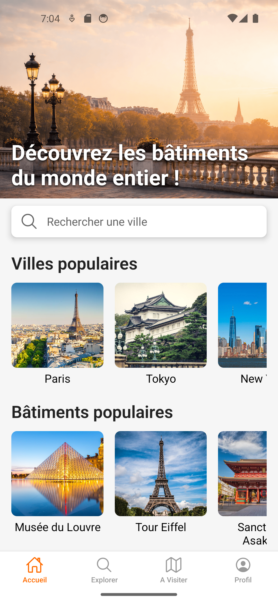
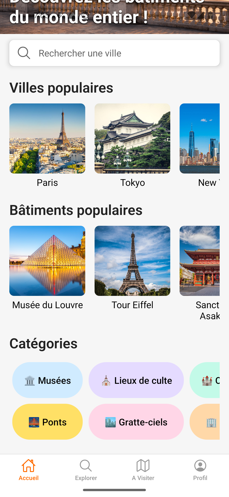

 
(Plus de captures d'écran ci-dessous)

## Le Projet

Le projet Visit My Cities répertorie les différents bâtiments remarquables de chaque ville. Une application mobile permet aux visiteurs de planifier leurs visites lors de leur séjour dans une ville. Les visiteurs peuvent consulter les bâtiments selon leurs préférences (année de construction, style architectural, catégories). Un utilisateur expert a la possibilité d'ajouter de nouveaux bâtiments. Chaque bâtiment dispose de nombreuses informations utiles pour organiser une visite.

## Licence ❗

- Le code source est publiquement visible à des fins d'évaluation uniquement et ne peut
  pas être réutilisé sans autorisation préalable explicite.

## Démarrage

### Lancer l'application Visit My Cities

Pour lancer l'application **Visit My Cities** en local, vous devez d'abord démarrer les services de base de données via Docker. Le projet utilise un conteneur qui inclut **MySQL** et **phpMyAdmin**.

Démarrez les conteneurs avec :

docker-compose up -d

Cela lancera la base de données MySQL ainsi que phpMyAdmin, vous permettant de gérer la base de données depuis votre navigateur.

Une fois la base de données lancée, démarrez l'API REST avec un outil tel qu'IntelliJ.

Une fois les conteneurs et l'API REST en cours d'exécution, vous pouvez démarrer l'application front-end.

Depuis le répertoire du projet frontend :
npm install
npm run start

Cela démarrera le serveur de développement.

### Lancer l'application

Vous pouvez lancer l'application de deux façons :

**1. Avec Android Studio ou le simulateur iOS**
Ouvrez un émulateur Android depuis Android Studio ou un simulateur iOS depuis Xcode et lancez le projet. L'application se connectera automatiquement au serveur de développement local.

**2. Avec votre téléphone physique**
Si vous souhaitez lancer l'application sur votre propre téléphone, vous devez configurer correctement les variables d'environnement.

En particulier, vous devez remplacer l'API_URL par **l'adresse IP locale de votre ordinateur**, sinon le téléphone ne pourra pas atteindre le serveur.

Par exemple :

EXPO_PUBLIC_API_URL_TELEPHONE=http://192.168.X.X:8080

Une fois les variables d'environnement configurées, redémarrez le serveur de développement et scannez le QR code (ou lancez l'application) depuis votre appareil.

**Les fonctionnalités disponibles :**
- Afficher une liste de villes et bâtiments populaires
- Afficher une liste de catégories de bâtiments
- Afficher les bâtiments/lieux pour chaque ville avec nom et image
- Consulter les informations détaillées de chaque bâtiment (adresse, horaires d'ouverture, description, informations clés, informations de visite, localisation)
- Naviguer entre les bâtiments et les villes dans l'application
- Gérer une liste de villes et bâtiments favoris
- Ajouter une ville ou un bâtiment aux favoris
- Afficher une carte avec la localisation du bâtiment
- Affichage basique du profil utilisateur (voir ses propres informations)
- Fonctionnalité de connexion et d'inscription (principalement utile pour les utilisateurs experts)
- Ajouter de nouveaux bâtiments via le formulaire (soumission front-end + traitement back-end)
- Afficher un itinéraire depuis votre position actuelle jusqu'au bâtiment via Google Maps

**Les fonctionnalités en cours de développement :**
- Ajouter le bouton favori sur les cartes de lieux
- Faire fonctionner la barre de recherche
- Ajouter les fonctionnalités de filtre et de tri
- Créer un écran de visite V2 avec la possibilité de regrouper les bâtiments par ville
- Implémenter la fonctionnalité de planification pour créer un itinéraire entre les bâtiments d'une ville
- Écran de profil avec plus d'informations (modification des informations personnelles)
- Créer un back-office externe plus élaboré, ou ajouter les fonctionnalités de suppression et modification pour les bâtiments et les villes
- Ajouter une carte en plein écran dans l'écran de détail du bâtiment pour afficher la position de l'utilisateur
- Ajouter la possibilité d'ouvrir un itinéraire avec Apple Maps
- Permettre aux utilisateurs de suggérer un nouveau bâtiment

**Technologies utilisées :**
- React Native (Zustand, Expo, React Hook Form)
- Spring Boot
- MySQL
- PhpMyAdmin
- Postman
- Docker

## Captures d'écran : ##

  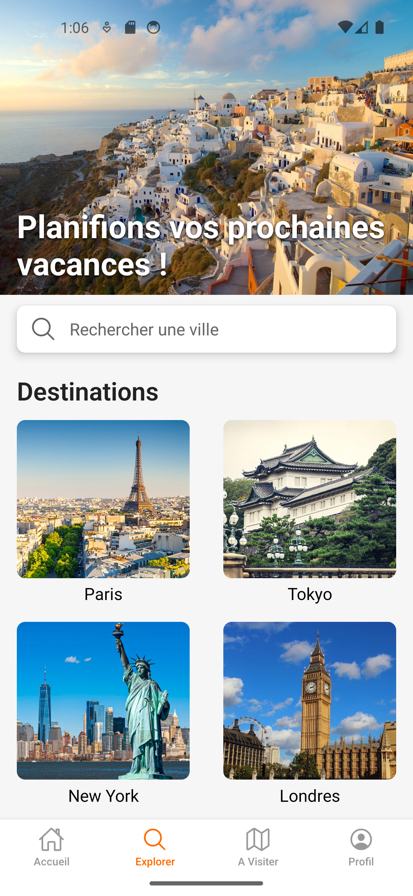
  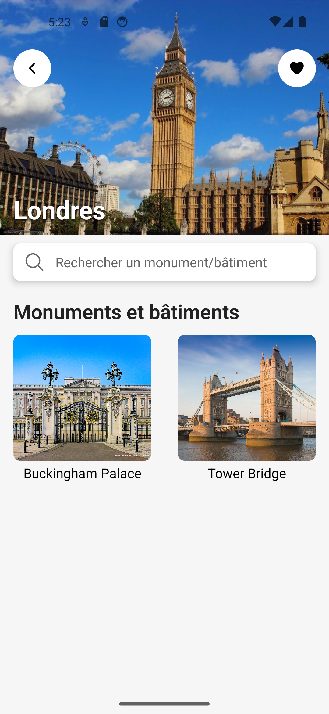

  

  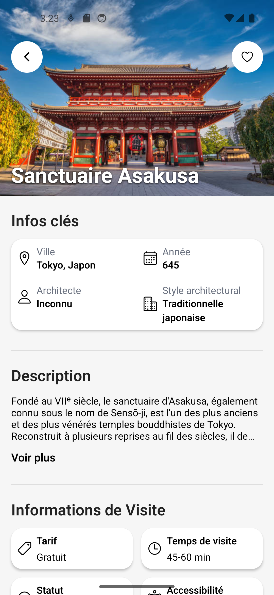
  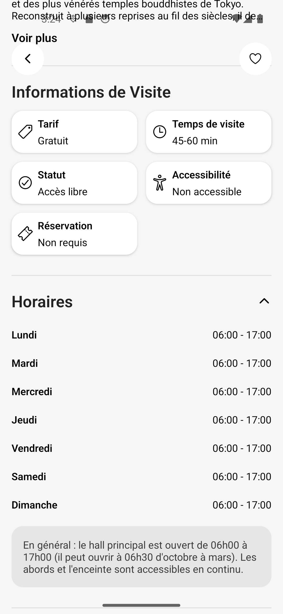
  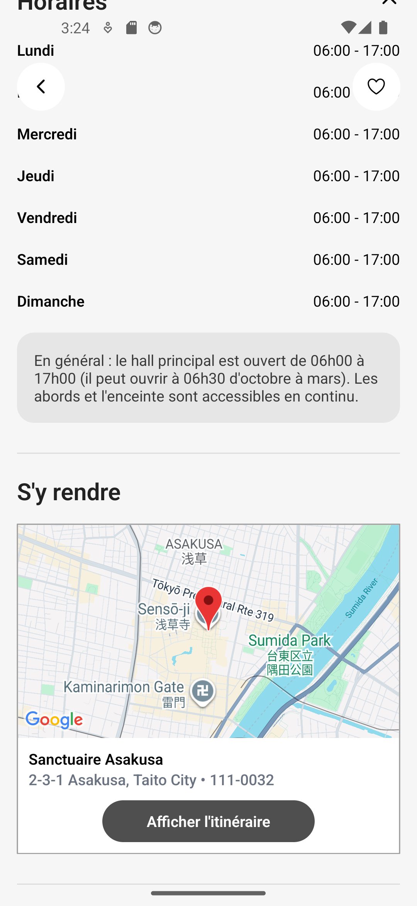

  

  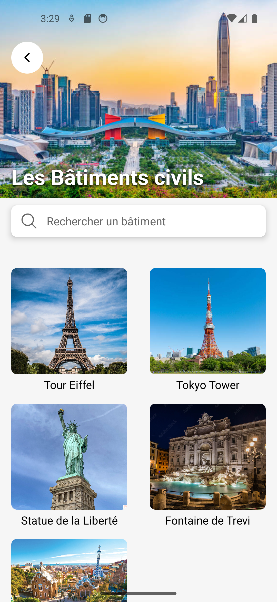
  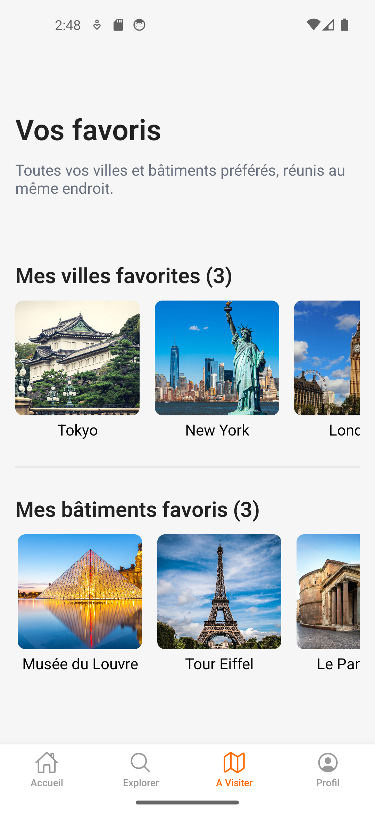

  

  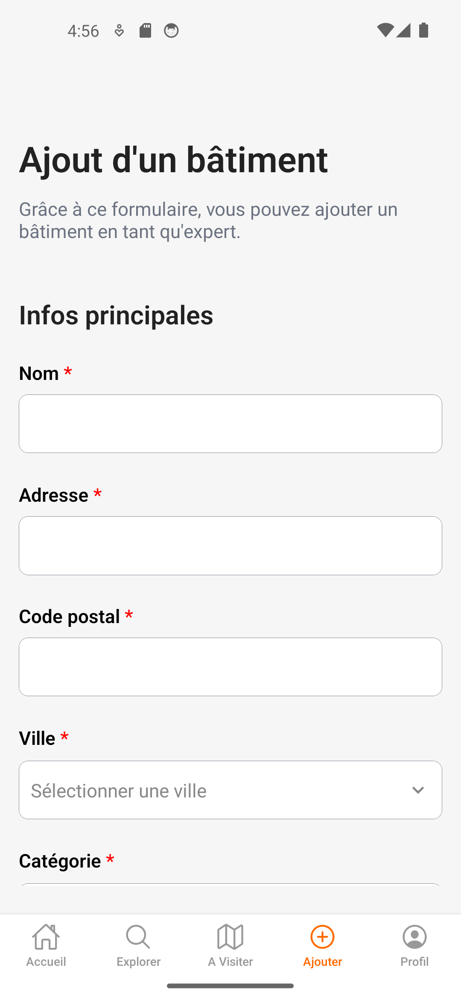
  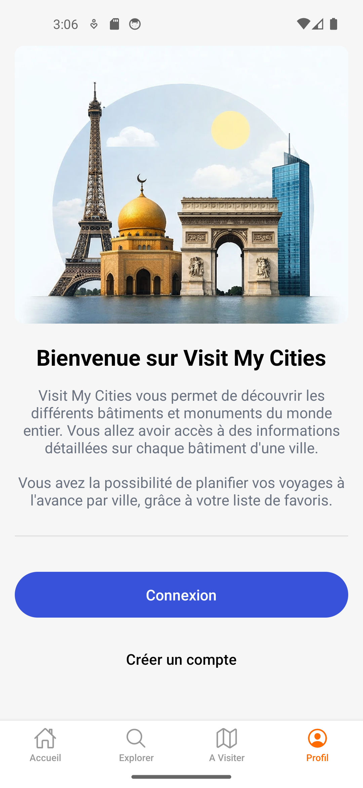
  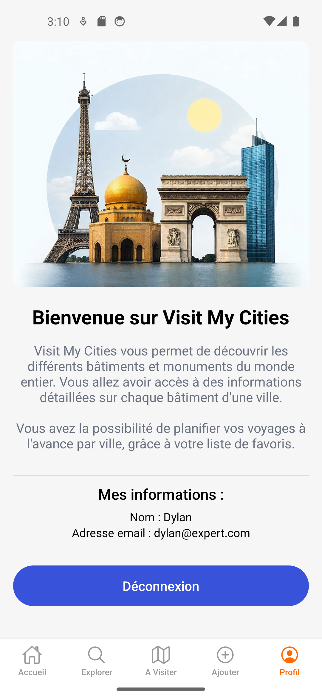

